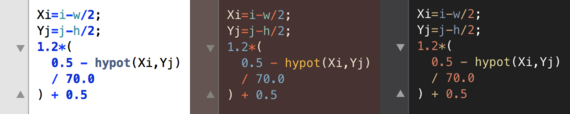

# ImageMagickFX.tmbundle ##
TextMate2 bundle for working with FX expressions

## Syntax & Code Folding##
Language grammar, functions, color names & values are highlighted respecting TextMate's theme selectors.
Parentheses, square brackets, and curly braces can be grouped, collapsed and expanded.

## Run FX script ##
Quickly review the results of a FX script by pressing <kbd>&#8984;</kbd> + <kbd>R</kbd>, or <kbd>&#8984;</kbd> + <kbd>&#8679;</kbd> + <kbd>R</kbd>

## Tooltip Help ##
View the definition of a variable, or function, by pressing <kbd>&#8963;</kbd> + <kbd>H</kbd>

